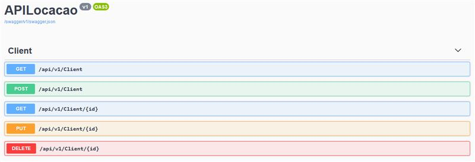
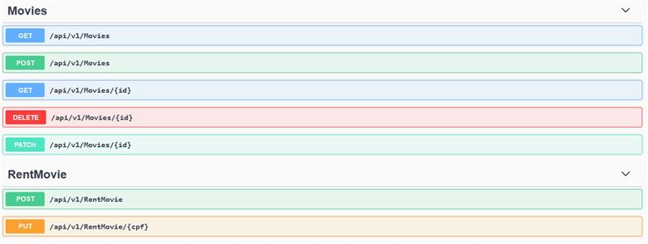

<h1>GFT - Programa Starter #4 🚀</h1>

# API-Locadora

### Time

Thiago Saraiva

Luiz Bender

André Oliveira

### Desafio

Criar um serviço REST (Web API) para gerenciar o ciclo mais básico de uma

locadora, cadastrar um filme, cadastrar locador, locar um filme e devolver

um filme. Partindo do princípio que você tenha um banco de dados com as seguintes

tabelas: Cliente, Filme e Locações.

[Pratica API.pdf](https://s3-us-west-2.amazonaws.com/secure.notion-static.com/9f720466-c16e-4d92-81c6-acf110b2a118/Pratica_API.pdf)

### Documentação do Projeto

[Notion](https://ruddy-ranunculus-3c2.notion.site/API-Locadora-40693ded71914ad289d45137ed2ce51e)

### Trello do projeto

[Trello](https://trello.com/invite/b/sp6NF60M/9fcb2c9c498816b8f9cec7238bf641bc/kanban-estudo-api)

### Controle de Reuniões

[Reuniões - API Locadora](https://www.notion.so/Reuni-es-API-Locadora-8d5f0539a1134205a156bddd6b83cd74)

<h3> 🚩 Rotas da API</h3>

<h3> ▶️ Executando o projeto</h3>
 
 ### Como instalar
- Faça o clone do projeto  
<code>https://git.gft.com/tesv/desafiomvc.git </code>
- Para restaurar os pacotes use o  
<code>dotnet restore </code>
- Para instalar entity framework globalmente  
<code>dotnet tool install --global dotnet-ef</code>
- Dentro da aplicação acesse appsettings.json coloque a string de conexão de acordo com o seu banco de dados- Atualizar a base de dados com o mysql  
<code>dotnet ef database update </code>
- Use o comando  
<code>dotnet watch run </code>

<h3> 💻Tecnologias</h3>

- DOTNET CORE 5.0
- ASP .NET CORE IDENTITY 5.0.12
- ENTITY FRAMEWORK CORE 5.0.12
- MySql
